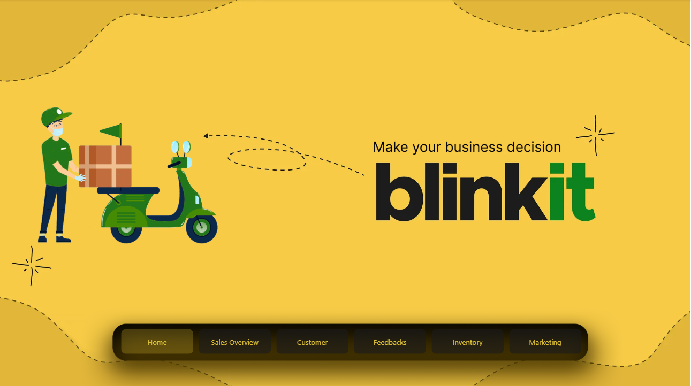

### Blinkit Power BI Dashboard Project

Project Overview

https://app.powerbi.com/reportEmbed?reportId=d770eb38-fb55-48a2-bdba-258f4c38872c&autoAuth=true&ctid=27282fdd-4c0b-4dfb-ba91-228cd83fdf71

Blinkit is a quick-commerce platform delivering groceries and essentials in minutes. With high-volume orders, inventory movement, and customer interactions, managing and analyzing operational data efficiently is critical.This project focuses on building a comprehensive Power BI dashboard to consolidate key metrics, visualize trends, and provide actionable insights for better decision-making and operational efficiency.

## Goals
Track key performance indicators (KPIs) including:
  - Daily/weekly/monthly orders
  - Delivery times and bottlenecks
  - Inventory status and restocking needs
  - Customer satisfaction and feedback trends
 Revenue and profit margins
- Enable interactive data exploration with real-time updates and dynamic filtering
- Support data-driven decisions to improve efficiency and customer experience

## Target Audience
- Business stakeholders seeking high-level performance summaries
- Operations managers monitoring processes and logistics
- Data analysts exploring backend data for deeper insights

## Key Features
- Intuitive charts: line charts, bar charts, pie charts, gauges
- Drill-down capabilities for detailed analysis
- Filters by time, region, or product category
- Exportable reports for sharing with team members

## Conclusion

The Blinkit Power BI Dashboard project demonstrates how data can be transformed into actionable insights to drive operational efficiency, improve customer experience, and support strategic decision-making. By consolidating key metrics into an interactive and visually intuitive dashboard, this project highlights the power of analytics in a fast-paced, real-world business environment and provides a scalable framework for similar quick-commerce platforms.

